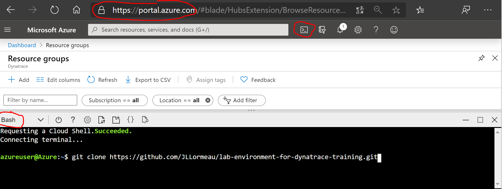

# Lab environment for dynatrace training
This script permits to deploy quickly several Ubuntu VM with Docker Engine on an Azure subscription. It's usefull for a workshop and Dynatrace Training. Several options are available to deploy and start automatically easytravel or to do the workshop on Kubernetes with Azure Vote App. 

Open your azure subscription, https://portal.azure.com/ 
Open your azure cli like described here :  

**TRAINING DYNATRACE**  
**DEPLOY training environment for Dynatrace Lab** : Go to your Azure Cli and apply these commands
   
    cd;if [ -d "./lab-environment-for-dynatrace-training" ];then rm -rf ./lab-environment-for-dynatrace-training;fi
    git clone https://github.com/JLLormeau/lab-environment-for-dynatrace-training.git
    cd lab-environment-for-dynatrace-training;chmod +x ./azure-cli-deploy-vm-windows-and-linux-for-training-dynatrace.sh
    ./azure-cli-deploy-vm-windows-and-linux-for-training-dynatrace.sh
    ls
      
And define your configuration :

0. config env : training name =dynatracelab2020
1. config env : password =Dynatrace@2021
2. config env : value fisrt env =00
3. config env : nbr total env =2
4. add env : windows VM to env =Y
5. add env : easytravel installed =Y
6. add env : cron to stop Mongo at 15 H GMT =Y
7. stop Mongo : hour (GMT) of Mongo shutdown =15
8. kubernetes : script to deploy Azure Vote App on AKS =Y
9. start env : VM stared after installation =N

Max training environment = 20  
For each environment : 
   - 1 VM Linux UBUNTU = Standard_D1_v2 (1 CPU; 3.5 GB RAM)  
   - Option on the Linux VM 
      * easytravel docker insalled and started  
      * crontab to stop mongodb 20 minutes every day and generated problems  
      * kubernetes : script to deploy Azure Vote App on AKS for the workshop Kubernetes (need a Service Principal for the authentication)   
   - Option on the training environment
      * 1 VM Windows 10 = Standard_B2s (2 CPU; 4GB RAM) for these workshop : LoadGen, Android and Plugin Python 

With default configuration the script will deploy 2 environments with all options enabled:  
user00;dynatracelab00.francecentral.cloudapp.azure.com;windynatracelab00.francecentral.cloudapp.azure.com;*****  
user01;dynatracelab01.francecentral.cloudapp.azure.com;windynatracelab01.francecentral.cloudapp.azure.com;*****  

- Linux,  direct access from a bowser (443)       : https://dynatracelab00.francecentral.cloudapp.azure.com  
- (optional) EasytravelDocker,  installed and started  (80)  : http://dynatracelab00.francecentral.cloudapp.azure.com  
- (optional) Windows,  access with mstsc (3389)   : windynatracelab00.francecentral.cloudapp.azure.com  

By default, the VM are installed and stopped.  Start the VM when you are readey on your Azure portals :
https://portal.azure.com/#blade/HubsExtension/BrowseResourceBlade/resourceType/Microsoft.Compute%2FVirtualMachines

By default, the crontab is configured to stop mongodb for 20 minutes at 15 H GMT:  
 - To show the cron, use this command :   sudo crontab -l  
 - To edit the cron, this command :       sudo crontab -e  
 - And to erase the cron, this one :      sudo crontab -r  

At the end of the workshop, to delete the labs resource groups, execute the script which has been automaticaly generated locally on your Azure Cli bash /home/azureuser/lab-environment-for-dynatrace-training

**To automatically deploy easytravel configuration on your tenant** :   
Go to this lab with monaco for easytravel : https://github.com/JLLormeau/monaco-lab

**INSTALL the Kubernetes environment**  : 
To automatically deploy Azure Vote App on your Azure Subscription, use the training VM Ubuntu and run this script with these 3 parameters :  

    /home/dynatracelab_kubernetesaks/deploy-aks-cluster-with-azure-voting-app.sh $APPID $PASSWORD $TENANT

Prerequisiste : 
   - Deploy the training VM Ubuntu with the option "Kubernetes : script to deploy Azure Vote App on AKS "= Enabled (see below) 
   - Azure quota on the regions eastus and eastus2  
   - Azure Service Principal with $APPID $PASSWORD and $TENANT to connect to your Azure Subscription and create the AKS for Azure Vote App.    
You can use the same Service Principal for all the Azure Vote App deployments.  
Go to your Azure Cli Bash and use this az command to create your Service Principal:   

    az ad sp create-for-rbac --name MyServicePrincipalNameforLabKube

more detail about Azure Service Principal : https://docs.microsoft.com/en-us/cli/azure/create-an-azure-service-principal-azure-cli  
more information on Auze Vote App : https://docs.microsoft.com/en-us/azure/aks/tutorial-kubernetes-prepare-app  

At the end of the workshop, to delete the labs resource groups on each AKS, execute the script which has been automaticaly generated locally on each VM on /home/dynatracelab_kubernetesaks/  
